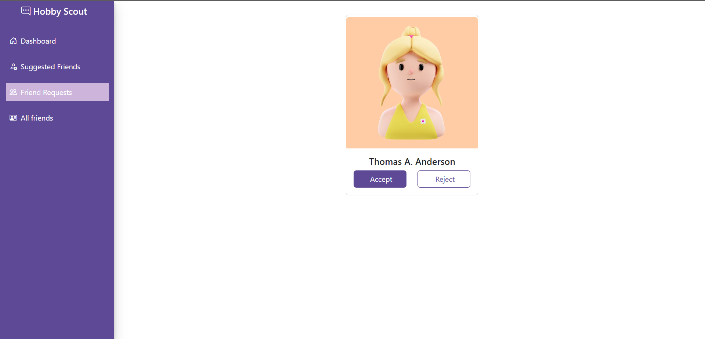

# Challenge 3 - Friend Request Management

In this challenge, you are required to implement functionalities related to managing friend requests in the `HobbyScout` application.

## Core Functionalities

1. Send a Friend Request 
2. Check pending requst ( Already sent or recived)
3. Accept Friend requests
4. Reject Firend requests


# Test Cases

The provided test suite covers various scenarios to ensure the proper functionality of friend request management in the HobbieSkout.

## Challenge 3.a
 The test ensures that users can successfully send friend requests. It checks if the response contains the word `success` after sending a request. Modify the method `sendReq(data)` inside the `friendRepository` to send a friend request successfully. Here's what you need to do,
 1. Rewrite the SQL query to insert data(`sender_data`, `recipient_id` and `status` as `"PENDING"`) to the `friends` table in the database.
 2. Return `"success"` after successful insertion.

## Challenge 3.b

 This test verifies that the system detects when a user tries to send a friend request to another user to whom a request has already been sent. Update the correct method in `friendRoutes` inside the `routes` directory.

 API: ```/api/friends/request``` should return ```"Request already sent!"```  for this scenario. Here's what you need to do,
 1. Return `"Request already sent!"` if there exists any record with the same sender_id in the `friends` table.


## Challenge 3.c
This test ensures that the system detects when a user tries to send a friend request to a user who has already sent a request to them. Update the correct method in `friendRoutes` inside the `routes` directory.

API : ```/api/friends/request``` should return ```"Request already received!"``` for this scenario . 
1. Return `"Request already received!"` if there exists a friend request from the recipient in the `friends` table.


## Challenge 3.d

This test checks whether the system correctly counts the number of friend requests sent by a user. Your task is to update the method `viewSentReqs(id)` inside the `friendsRepository` to return users whom requests were sent. `id` refers to the `sender_id` attribute of the `friends` table. Query through the `friends` table and check whether there exists any records with the given `sender_id`. However, only the `PENDING` requests should return as the number of friend requests sent by a user.

Hint: You can use `getUser(id)` method in `userRepository` to fetch each user details and return an array of users whom requests were sent as the output.

If the user doesn't have any sent friend requests, then the method should return an empty array.

If the user have any sent friend requests, then the output should be like this,
```json
[
    {
        "id": 1,
        "email": "siu@cr7.com",
        "gender": "Male",
        "firstname": "Cristiano",
        "lastname": "Ronaldo",
        "image_url": "https://www.irishtimes.com/resizer/geEGpNJqT_hxa139T5HWfq8YdYw=/1600x0/filters:format(jpg):quality(70)/cloudfront-eu-central-1.images.arcpublishing.com/irishtimes/C752OG447LSTHDRHTADVXYWCPQ.jpg",
        "hobbies": [
            {
                "name": "Gym",
                "rate": 4
            },
            {
                "name": "Soccer",
                "rate": 5
            },
            {
                "name": "Sports",
                "rate": 3
            }
        ],
        "skills": [
            {
                "name": "C++",
                "rate": 4
            },
            {
                "name": "Java",
                "rate": 5
            },
            {
                "name": "Python",
                "rate": 3
            }
        ]
    },
    {
        "id": 2,
        "email": "ney@nj.com",
        "gender": "Male",
        "firstname": "Neymar",
        "lastname": "Jr.",
        "image_url": "https://pbs.twimg.com/media/EK-YsU9XYAU7R-o?format=jpg&name=medium",
        "hobbies": [
            {
                "name": "Music",
                "rate": 1
            },
            {
                "name": "Soccer",
                "rate": 5
            },
            {
                "name": "Video Games",
                "rate": 2
            }
        ],
        "skills": [
            {
                "name": "Javascript",
                "rate": 5
            },
            {
                "name": "Photography",
                "rate": 4
            }
        ]
    }
]
```
In the above response, `id` refers to each user's `id` in the `users` table.
For this test case, method should return an empty array as there are no records with `sender_id` of user `Liyana` where the `status` is `PENDING` in the `friends` table.

## Challenge 3.e

The test retrieves an array of pending friend requests for the authenticated user and validates the response against the expected format. Your task is to implement the `viewPendingReqs(id)` method inside `friendsRepository` to return the users whom the requests were received. Parameter `id` is the `recipient_id` in the `friends` table.

Hint: You can use `getUser(id)` method in `userRepository` to fetch each user details and return an array of users whom requests were received as the output.

After successful implementation, you will be able to view the pending friend requests through the application as below.
<p align="center">
  
</p>

Note: User avatar image can be different and ignore it as it was generated randomly.

## Challenge 3.f

The test ensures that the system can accept a friend request and mark it as accepted.

On successfull friend request accept, API : ```/api/friends/${reqId}/accept-request ``` should return ```success``` and in database request, `status` should be updated to ```"ACCEPTED"```. Here's what you have to do,
1. Rewrite the SQL query in the method `acceptReq(id)` inside the `friendsRepository` to accept a friend request by updating the `status` attribute in `friends` table to `"ACCEPTED"`. Parameter `id` is the `id` attribute in the `friends` table. 
2. Return `"success"` after successful implementation.

## Challenge 3.g

The test verifies that the system can reject a friend request and remove it from the pending requests list.

On successful rejection , API ```/api/friends/${reqId2}/reject-request``` should return  ```"Request deleted successfully"```. Also, the relevent record should be deleted from the database. Update the method `rejectReq(id)` inside the `friendsRepository` to reject the friend request by deleting the relevant record from the `friend` table. Here's what you have to do,
1. Rewrite the SQL query in the method `rejectReq(id)` inside the `friendsRepository` to delete a friend request by removing the relevant record from `friends` table. Parameter `id` is the `id` attribute in the `friends` table.
2. Return `"Request deleted successfully"` after successful deletion.
