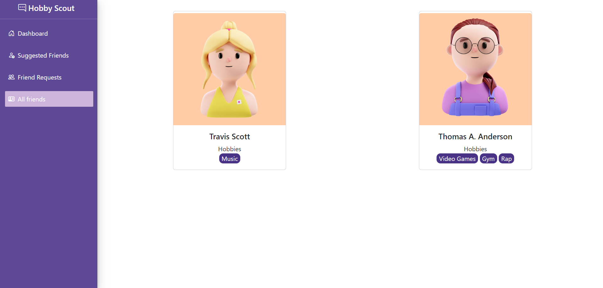

# Challenge 4 - View Friends and Their Details

In this challenge, you are required to implement functionalities to allow users to view their existing friends and their details in the HobbieSkout application.

## Core Functionalities

1. Return an Array of Friends (Challenge 4.a): Users can retrieve an array of their accepted friends. The response should include information about each friend, such as their `id`, `email`, `gender`, `firstname`, `lastname`, `image_url`, `hobbies`, and `skills`.

## Test Case

The provided test suite checks the functionality of retrieving an array of friends for the authenticated user. It ensures that the response contains the correct details of each friend.

### Challenge 4.a 

The test retrieves the list of accepted friends for the authenticated user from the database. It then sends GET requests to the appropriate endpoints to fetch the details of each friend based on their `id`. The test validates that the responses contain the correct information for each friend as shown in below.

Implement the method `viewFriends(id)` inside the `friendRepository` to return the friends in the `friends` table. Check whether there exists records where the respective user sent a request where status is `ACCEPTED` and the user recieved a request where status is `ACCEPTED`. The parameter `id` in the method `viewFriends(id)` refers to the `id` attribute in the `friends` table. Then return the list of friends as below.

Hint: You can use `getUser(id)` method in `userRepository` to fetch each user details and return an array of users whom requests were received as the output.

expected output for user `Liyana`,

```json
[
      {
        "id": 3,
        "email": "laflame@cactusjack.com",
        "gender": "Female",
        "firstname": "Travis",
        "lastname": "Scott",
        "image_url":
          "https://upload.wikimedia.org/wikipedia/commons/thumb/1/14/Travis_Scott_-_Openair_Frauenfeld_2019_08.jpg/500px-Travis_Scott_-_Openair_Frauenfeld_2019_08.jpg",
        "hobbies": [
          {
            "name": "Music",
            "rate": 5,
          },
        ],
        "skills": [
          {
            "name": "Java",
            "rate": 2,
          },
        ],
      },
      {
        "id": 5,
        "email": "random@user.com",
        "gender": "Female",
        "firstname": "Thomas",
        "lastname": "A. Anderson",
        "image_url":
          "https://th.bing.com/th/id/OIP.bEl-isZYhCmzsIGyhdEatgHaEK?pid=ImgDet&rs=1",
        "hobbies": [
          {
            "name": "Video Games",
            "rate": 1,
          },
          {
            "name": "Gym",
            "rate": 5,
          },
          {
            "name": "Rap",
            "rate": 5,
          },
        ],
        "skills": [
          {
            "name": "Dancing",
            "rate": 3,
          },
          {
            "name": "Docker",
            "rate": 5,
          },
        ],
      },
    ]

```
In the above response, `id` refers to each user's `id` in the `users` table.
After successful implementation, you will be able to view the friends through the application as below.
<p align="center">
  
</p>
Note: User avatar image can be different and ignore it as it was generated randomly.
