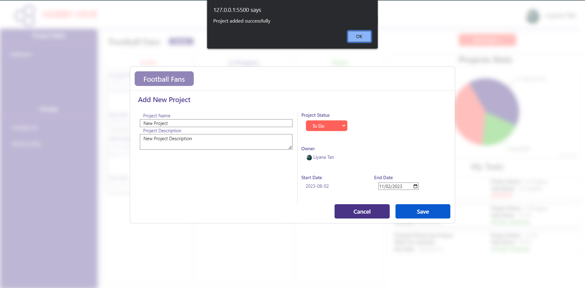

# Challenge 6 - Add new project to a group

After successfully completing the Challenge 5 you can click on either one of those groups displayed and get the relevent project and task details regarding the group as displayed in the image below.

  

In this challenge your task is to implement the funtionaility to add a new project to the relevent group.

When the user clicks on the `Add Project +` button on the right hand top corner of the page a modal will be visible and when the user enters project details and clicks on the `Save` button an alert will be displayed with a relevent message.

  

After the page reloads and upon clicking on the relevent group the newly added project will be displayed on the `To-Do` column.

  

To achieve that you first have to implement the `addNewProject(projectDetails)` method inside the `groupRepository` similar to the previous task but in this case the SQL query will be an INSERT query with all the details obtained in the `projectDetails` argument but in the order of the columns in the projects table.

This time the Promise has to return a message saying "success" after successfully saving the project details in the projects table in the database.
