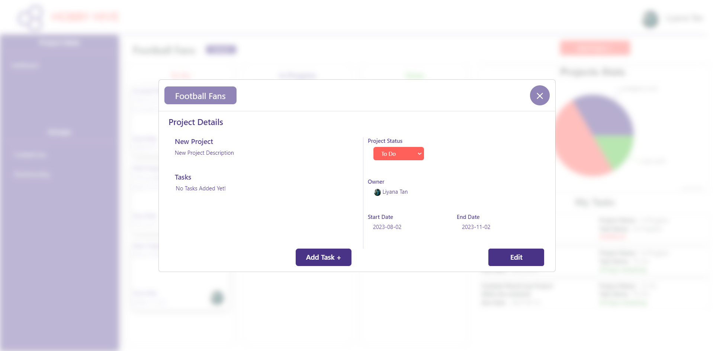
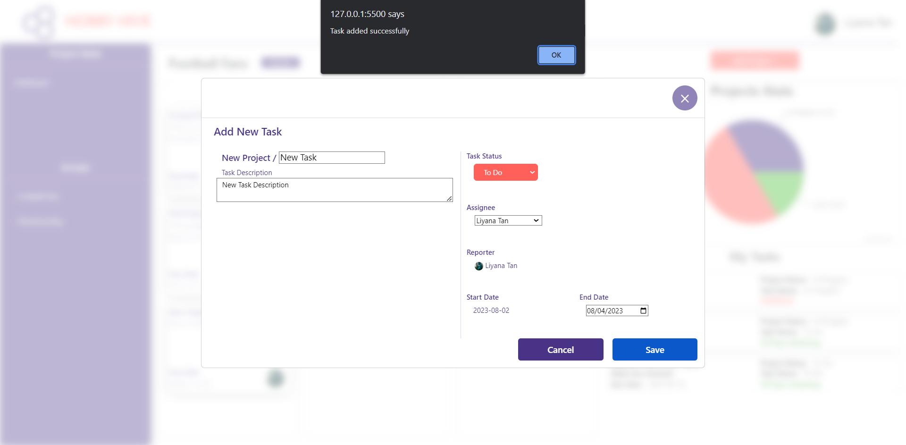
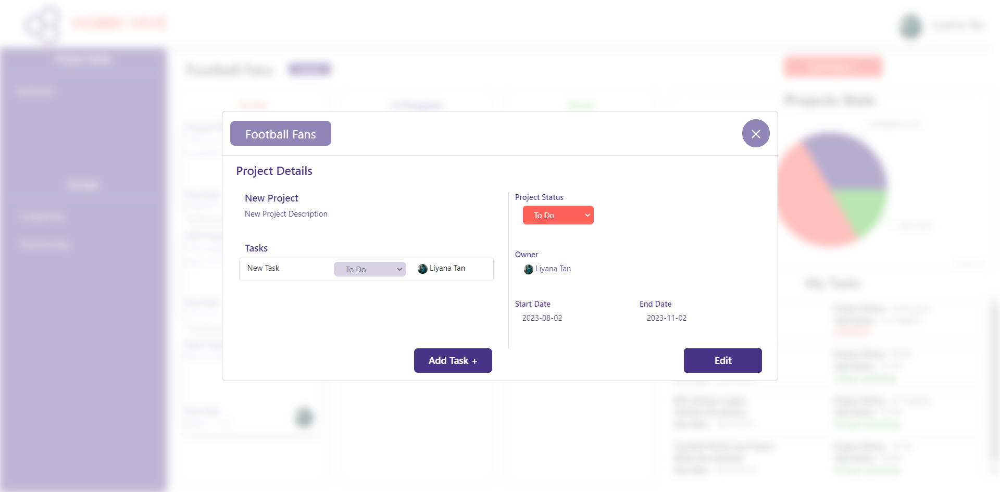

# Challenge 6 - Add new task to a project

After successfully completing the Challenge 6 you can now click on the newly create project card and view the project details on the pop-up modal and shown below.

  

In this challenge your task is to implement the funtionaility to add a new task to the relevent project.

When the user clicks on the `Add Task +` button on the modal content will changed and when the user enters the task details and clicks on the `Save` button an alert will be displayed with a relevent message.

  

After the page reloads and upon clicking on the relevent project the newly added task will be displayed under the tasks list.

  

To achieve that you first have to implement the `addNewTask(taskDetails)` method inside the `groupRepository` similar to the previous tasks but in this case the SQL query will be an INSERT query with all the details obtained in the `taskDetails` argument but in the order of the columns in the tasks table.

This time the Promise has to return a message saying "success" after successfully saving the task details in the tasks table in the database.
